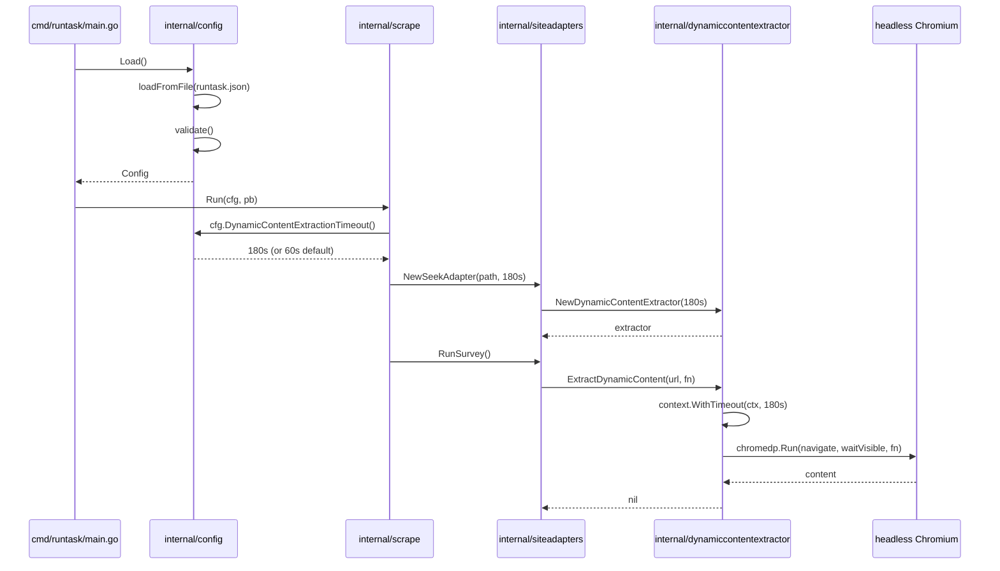
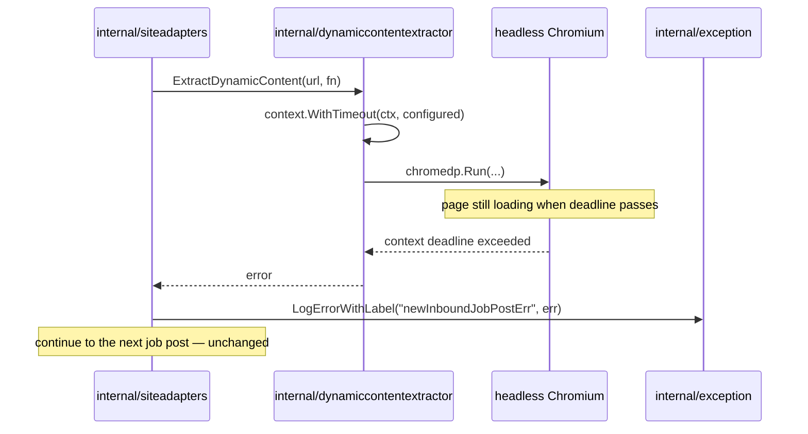
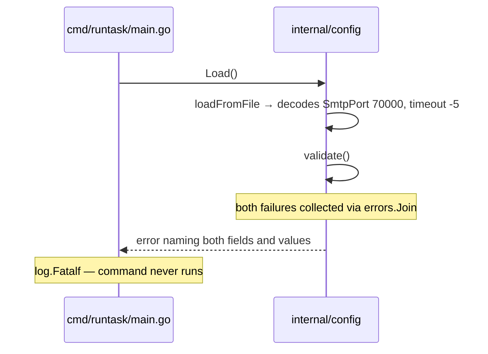

# Design: Configurable Dynamic Content Extraction Timeout and `runtask.json` Validation

Implements [`requirements.md`](./requirements.md).

## System Architecture

The timeout travels from `runtask.json` to the chromedp context along the existing call chain. No
new component is introduced.

**Before:**
```
main.go
  config.Load()                         runtask.json
  scrape.Run(cfg, pb)
    adapterForSite(siteName, cfg)
      NewSeekAdapter(cfg.SeekConfigFile)
      NewJoraAdapter(cfg.JoraConfigFile)
        NewDynamicContentExtractor()
    adapter.RunSurvey()
      ExtractDynamicContent(url, fn)
        context.WithTimeout(ctx, 60*time.Second)     ← hard-coded
```

**After:**
```
main.go
  config.Load()                         runtask.json + DynamicContentExtractionTimeoutSeconds
  scrape.Run(cfg, pb)
    adapterForSite(siteName, cfg)
      cfg.DynamicContentExtractionTimeout()          ← resolves seconds → time.Duration
      NewSeekAdapter(cfg.SeekConfigFile, timeout)
      NewJoraAdapter(cfg.JoraConfigFile, timeout)
        NewDynamicContentExtractor(timeout)
    adapter.RunSurvey()
      ExtractDynamicContent(url, fn)
        context.WithTimeout(ctx, d.dynamicContentExtractionTimeout)
```

### Components changed

| File | Change |
|---|---|
| `runtask/internal/config/config.go` | New field, default constant, validation, resolving accessor, and a `loadFromFile` seam for testing |
| `runtask/internal/dynamiccontentextractor/dynamiccontentextractor.go` | Constructor accepts a `time.Duration`; struct stores it; `ExtractDynamicContent` uses it |
| `runtask/internal/siteadapters/seekadapter.go` | `NewSeekAdapter` accepts and forwards the duration |
| `runtask/internal/siteadapters/joraadapter.go` | `NewJoraAdapter` accepts and forwards the duration |
| `runtask/internal/scrape/scrape.go` | `adapterForSite` resolves the duration from `cfg` and passes it |

### Layering

The value crosses package boundaries as a `time.Duration`, never as a `config.Config`. Neither
`siteadapters` nor `dynamiccontentextractor` imports `internal/config` today, and this change must
not introduce that import — configuration stays at the orchestration boundary (`main` → `scrape`),
and the lower packages receive a plain value.

## Key Decision: Defaulting and Validation Live in Two Different Places

Validation of a negative value belongs in `config.Load`; substitution of the 60-second default
belongs in the accessor. This split is not stylistic — putting the default only in `Load` breaks the
existing test suite.

`config.Config` is constructed directly as a struct literal, bypassing `Load()`, in five places:

| Location | Literal |
|---|---|
| `runtask/internal/scrape/scrape_test.go:188` | `config.Config{SeekConfigFile: ..., ErrorLogFile: ...}` |
| `runtask/internal/scrape/scrape_test.go:224` | `config.Config{SeekConfigFile: ..., ErrorLogFile: ...}` |
| `runtask/internal/report/report_test.go:163` | `config.Config{}` |
| `runtask/internal/report/report_test.go:203` | `config.Config{}` |
| `runtask/internal/housekeeping/housekeeping_test.go:145` | `config.Config{...}` |

None of these would set the new field, so `DynamicContentExtractionTimeoutSeconds` would be `0`. If
the default were applied only inside `Load()`, the resulting failure chain in the scrape tests would
be:

```
0 seconds → context.WithTimeout(ctx, 0) → deadline already exceeded
          → chromedp.Run returns immediately with an error
          → ExtractDynamicContent returns that error
          → seekadapter.go:96 logs it and `continue`s past the job post
          → RunSurvey returns zero posts
          → TestScrapeRunCreatesJobPosts sees 0 records (expects ≥ 1)   FAIL
          → TestScrapeRunIsIdempotent sees 0 records (expects exactly 1) FAIL
```

That directly violates the requirement that scrape "SHALL CONTINUE TO upsert job posts
idempotently".

Resolving the default inside `DynamicContentExtractionTimeout()` instead makes a zero-value
`config.Config` behave exactly as the code does today, so none of the five literals — and none of
the existing tests — need to change.

The negative-value check still belongs in `Load`, because that is the only path where a human-authored
file can supply one, and the requirement is to fail at startup with a message naming the field.

## Data Models and Interfaces

### `internal/config`

```go
const defaultDynamicContentExtractionTimeoutSeconds = 60

type Config struct {
	PocketBaseUrl                          string
	ServiceAccountEmail                    string
	ServiceAccountPassword                 string
	SeekConfigFile                         string
	JoraConfigFile                         string
	ErrorLogFile                           string
	SmtpDomain                             string
	SmtpPort                               int
	SenderEmail                            string
	SenderEmailPassword                    string
	EmailRecipient                         string
	DynamicContentExtractionTimeoutSeconds int
}

// DynamicContentExtractionTimeout resolves the configured seconds to a duration, substituting the
// default when the field is unset. A zero value is indistinguishable from an absent JSON field, so
// both — and any non-positive value — resolve to the default.
func (c Config) DynamicContentExtractionTimeout() time.Duration

func Load() (Config, error)                                        // resolves path next to executable
func loadFromFile(configFilePath string) (Config, error)           // opens, decodes, validates

// validate reports every field that violates an invariant, joined into one error.
func (c Config) validate() error
```

No struct tags are added: the existing fields rely on `encoding/json`'s case-insensitive match
against exported field names, and the new field follows that convention.

`Load()` is split so the decode-and-validate half is reachable from tests. `Load()` today derives its
path from `os.Executable()`, which during `go test` points at the compiled test binary in a build
temp directory — not a location a test should be writing config into. `loadFromFile` takes a path and
is called with a `t.TempDir()` file. It stays unexported; there is no caller outside the package.

### Validation

`validate()` is a single method covering every rule in the requirements, rather than one function per
field. Accumulating into one error is what makes the method worth extracting: the requirement to
report every failing field in one go needs a shared accumulator, which a per-field function cannot
provide.

```go
func (c Config) validate() error {
	var validationErrors []error

	if c.ErrorLogFile == "" {
		validationErrors = append(validationErrors,
			errors.New("ErrorLogFile must not be empty"))
	}
	if c.PocketBaseUrl != "" {
		if err := validateHttpUrl("PocketBaseUrl", c.PocketBaseUrl); err != nil {
			validationErrors = append(validationErrors, err)
		}
	}
	if c.SmtpPort != 0 && (c.SmtpPort < 1 || c.SmtpPort > 65535) {
		validationErrors = append(validationErrors,
			fmt.Errorf("SmtpPort must be between 1 and 65535, got %d", c.SmtpPort))
	}
	for fieldName, address := range map[string]string{
		"ServiceAccountEmail": c.ServiceAccountEmail,
		"SenderEmail":         c.SenderEmail,
		"EmailRecipient":      c.EmailRecipient,
	} {
		if address == "" {
			continue
		}
		if _, err := mail.ParseAddress(address); err != nil {
			validationErrors = append(validationErrors,
				fmt.Errorf("%s is not a valid email address: %q", fieldName, address))
		}
	}
	if c.DynamicContentExtractionTimeoutSeconds < 0 {
		validationErrors = append(validationErrors,
			fmt.Errorf("DynamicContentExtractionTimeoutSeconds must not be negative, got %d",
				c.DynamicContentExtractionTimeoutSeconds))
	}

	return errors.Join(validationErrors...)
}

// validateHttpUrl reports whether rawUrl is an absolute http or https URL with a host.
func validateHttpUrl(fieldName, rawUrl string) error
```

`errors.Join` returns nil for an empty slice, so the success path needs no special case.

Two properties of this shape matter:

- **Every check is guarded by "is it configured".** Only `ErrorLogFile` is checked for presence, because
  it is the only field every command needs. Every other check runs solely when the field is non-empty
  or non-zero, so a config valid for `housekeeping cleanfs` does not fail because it has no SMTP
  settings.
- **`validate()` is a method on `Config`, not part of `loadFromFile`.** That lets the unit tests build
  a `Config` literal per case and assert on the error, without writing a JSON file for every
  permutation. `loadFromFile` calls it once after decoding, and file-level tests cover the
  decode-then-validate path end to end.

Note that `validate()` is deliberately *not* called by `DynamicContentExtractionTimeout()` or by any
in-process `config.Config` literal. The five test literals listed above stay valid as-is.

### `internal/dynamiccontentextractor`

```go
type DynamicContentExtractor struct {
	chromedpOptions                 []chromedp.ExecAllocatorOption
	dynamicContentExtractionTimeout time.Duration
}

func NewDynamicContentExtractor(dynamicContentExtractionTimeout time.Duration) *DynamicContentExtractor
```

The existing positional composite literal at `dynamiccontentextractor.go:38` becomes a keyed literal
so the second field is assigned by name.

`ExtractDynamicContent` keeps its signature; only line 56 changes:

```go
timeoutCtx, timeoutCancel := context.WithTimeout(ctx, d.dynamicContentExtractionTimeout)
```

### `internal/siteadapters`

```go
func NewSeekAdapter(configFilePath string, dynamicContentExtractionTimeout time.Duration) (*SeekAdapter, error)
func NewJoraAdapter(configFilePath string, dynamicContentExtractionTimeout time.Duration) (*JoraAdapter, error)
```

Both constructors have exactly two callers, `scrape.go:63` and `scrape.go:65`. No test constructs an
adapter directly.

### `runtask.json`

```json
{
  "PocketBaseUrl": "http://192.168.8.143:8090",
  "ServiceAccountEmail": "runtask@skillsurvey.com",
  "SeekConfigFile": "seek.json",
  "JoraConfigFile": "jora.json",
  "ErrorLogFile": "error.log",
  "DynamicContentExtractionTimeoutSeconds": 180
}
```

Omitting the key keeps the current 60-second behaviour, so deployed config files need no edit.

## Sequence Diagrams

### Startup and a single page extraction



### Timeout expiry during extraction



### Invalid config rejected at startup



## Error Handling

**Invalid configured value.** `loadFromFile` returns whatever `validate()` produces, wrapped the same
way the existing `open` and `decode` errors are. `main.go:27` already calls `log.Fatalf` on any
`config.Load()` error, which satisfies "SHALL NOT run the requested command" with no change to `main`.

Because `errors.Join` formats its members one per line, a multi-field failure prints as a readable
list without any custom formatting.

Note that this error is reported before `exception.Init(cfg.ErrorLogFile)` runs at `main.go:31`, so
it goes to stderr — and therefore to cron mail — rather than to the error log. That is the existing
behaviour for every configuration error and is not changed here; it is the correct behaviour anyway,
since the error log path itself comes from the config being rejected. It matters more now that
`ErrorLogFile` is one of the validated fields: a config whose log path is empty could not report its
own rejection to the log.

**Timeout expiry.** `chromedp.Run` returns a context error, which `ExtractDynamicContent` returns
unchanged. Both adapters already log it through `exception.LogErrorWithLabel` and continue to the
next page or job post. No error-handling code changes.

**Absent or zero value.** Not an error for any field except `ErrorLogFile`. The timeout resolves to 60
seconds via the accessor; every other unset field simply skips its format check.

## Testing Strategy

Tests run on the OpenBSD server per `CLAUDE-project.md`. The integration test is written first, then
the unit tests, then the implementation.

### Integration — the configured value is actually in force

New test file in `internal/dynamiccontentextractor`, following the `httptest` stub pattern already
used by `scrape_test.go`:

- **Short timeout aborts a slow page.** An `httptest` server whose handler sleeps ~30s before
  responding; an extractor built with a 2s timeout; assert `ExtractDynamicContent` returns an error
  and that the call returns well inside the handler's sleep (say under 20s). Measuring the elapsed
  time is what proves the *configured* value governed the abort rather than some other failure.
- **Generous timeout allows a normal page.** The same stub responding immediately; an extractor
  built with a 30s timeout; assert `ExtractDynamicContent` returns nil and the extract function ran.

These require Chromium on the machine. That is not a new dependency — the existing
`TestScrapeRunCreatesJobPosts` already drives chromedp through the Seek adapter's job-page fetch.

### Unit — timeout resolution

Table test over `loadFromFile`, each case writing a JSON file into `t.TempDir()`. Every case includes
a valid `ErrorLogFile`, since that field is now required:

| Input | Expected |
|---|---|
| timeout field absent | `DynamicContentExtractionTimeout()` == 60s |
| `"DynamicContentExtractionTimeoutSeconds": 0` | 60s |
| `"DynamicContentExtractionTimeoutSeconds": 180` | 180s |
| `"DynamicContentExtractionTimeoutSeconds": -1` | `loadFromFile` returns an error mentioning the field name |

Plus a separate case that does not go through a file at all: `config.Config{}` — the zero value used
by the five struct literals — resolves to 60s. This is the specific guard against the regression
described under Key Decision.

### Unit — validation

Table test over `Config.validate()` using struct literals, one case per rule, asserting both that the
expected fields are named in the error and that valid values produce nil:

| Case | Expected |
|---|---|
| all validated fields well-formed | nil |
| `ErrorLogFile` empty | error naming `ErrorLogFile` |
| `PocketBaseUrl` = `"192.168.8.143:8090"` (no scheme) | error naming `PocketBaseUrl` |
| `PocketBaseUrl` = `"http://"` (no host) | error naming `PocketBaseUrl` |
| `PocketBaseUrl` = `"ftp://host"` | error naming `PocketBaseUrl` |
| `PocketBaseUrl` empty | no `PocketBaseUrl` error |
| `SmtpPort` = 587 | nil |
| `SmtpPort` = 70000 | error naming `SmtpPort` |
| `SmtpPort` = 0 | no `SmtpPort` error |
| `SenderEmail` = `"not-an-address"` | error naming `SenderEmail` |
| each email field empty | no error for that field |
| `ErrorLogFile` empty **and** `SmtpPort` = 70000 | one error naming **both** fields |

The last row is the requirement that all failures are reported together; asserting on a single joined
error is why `validate()` needs the accumulator.

A further case covers the command-shaped configurations the requirements protect: a `Config` holding
only `ErrorLogFile` — valid for `housekeeping cleanfs` — must validate successfully. This is the guard
against validation quietly becoming a presence check on every field.

### Regression

`TestScrapeRunCreatesJobPosts` and `TestScrapeRunIsIdempotent` must pass **unmodified**. Needing to
edit either one is the signal that the defaulting landed in the wrong place.

`go test ./runtask/... -count=1` covers the rest of the unchanged-behaviour requirements
(housekeeping, report).

The deployed `runtask.json` must also be checked against the new rules before rollout. The dev copy at
`runtask/build/runtask.json` on the server has been inspected and passes: eleven fields present,
`PocketBaseUrl` carries an `http://` scheme, `SmtpPort` is 587. The production copy lives under
`/home/skillsurvey/` and is not readable as `junying`, so it must be verified by whoever deploys as
`skillsurvey` — validation turns a previously tolerated malformed value into a startup failure.

### Flakiness

chromedp tests on this host produce websocket timeouts when the machine is busy. Run with `-count=1`
on an otherwise idle server before concluding a failure is real. The margins above (2s timeout
against a 30s sleep; 30s timeout against an instant response) are deliberately wide for this reason.

## Rejected Alternatives

**Default applied only in `config.Load()`.** Breaks the five struct literals and two existing scrape
tests, as traced under Key Decision.

**One validation function per field.** Reads tidily but cannot satisfy the requirement to report every
failing field in one error, because there is nowhere to accumulate. It also produces function names
that only restate their single condition.

**Validating presence of every field at load time.** Rejected in `requirements.md`, and worth restating
here because it is the tempting reading of "validate the config": `main` loads the config before it
dispatches the command, so a blanket presence check would make `housekeeping cleanfs` fail on a config
with no SMTP settings, and `report` fail on a config with no adapter paths. Per-command presence
validation would work, but it means restructuring `main` to validate after dispatch — a larger change
than this one, for a failure mode that currently surfaces as a clear error from the SMTP or PocketBase
call anyway.

**Checking `SeekConfigFile` and `JoraConfigFile` exist at load time.** Would convert a per-site skip
that `scrape.adapterForSite` already logs and continues past into a total startup failure, including
for commands that never open those files.

**Default applied inside `NewDynamicContentExtractor`.** Would work, but puts configuration policy in
the lowest layer and leaves `config` exposing a value that does not mean what it says.

**Passing `config.Config` into `siteadapters`.** Would avoid threading a parameter through two
constructors, but drags configuration into a layer that is currently free of it.

**Per-site timeouts in the Seek and Jora adapter config files.** Out of scope per `requirements.md`.

**An environment-variable override.** `requirements.md` keeps the no-environment-variable rule.
